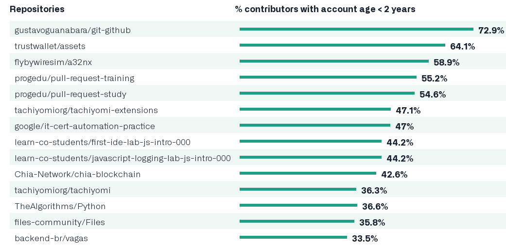

## Основная информация
___
**Git** — абсолютный лидер по популярности среди современных систем управления версиями. Это развитый проект с активной поддержкой и открытым исходным кодом. Система Git была изначально разработана в 2005 году Линусом Торвальдсом — создателем ядра операционной системы Linux. Git применяется для управления версиями в рамках колоссального количества проектов по разработке ПО, как коммерческих, так и с открытым исходным кодом. Система используется множеством профессиональных разработчиков программного обеспечения. Она превосходно работает под управлением различных операционных систем и может применяться со множеством интегрированных сред разработки (IDE).

Git — система управления версиями с распределенной архитектурой. В отличие от некогда популярных систем вроде CVS и Subversion (SVN), где полная история версий проекта доступна лишь в одном месте, в Git каждая рабочая копия кода сама по себе является репозиторием. Это позволяет всем разработчикам хранить историю изменений в полном объеме.

Разработка в Git ориентирована на обеспечение высокой производительности, безопасности и гибкости распределенной системы.

Кроме всего этого, представляю Вам статистику Git за 2021 год:

+ За 2021 год было создано 61 млн новых репозиториев (за 2020 год - 60 млн, за 2019 - 44 млн) и отправлено более 170 млн pull-запросов. Общее число репозиториев достигло отметки в 254 млн.

+ Аудитория GitHub возросла на 15 млн пользователей и достигла 73 млн (в позапрошлом году было 56 млн, позапрошлом - 41 млн, три года назад - 31 млн). 3 млн пользователей впервые подключилось (отправили изменение) к разработке открытого ПО (в 2020 году - 2.8 млн).

+ За год число пользователей GitHub из России увеличилось с 1.5 до 1.98 млн, из Украины - с 646 до 815 тысяч, из Беларуси - с 168 до 214 тысяч, из Казахстана - с 86 до 118 тысяч. В США насчитывается 13 млн пользователей, в Китае - 7.5 млн, в Индии - 7.2 млн, в Бразилии - 2.3 млн, в Великобритании - 2.2 млн, в Германии - 1.9 млн, во Франции - 1.5 млн.

+ Самым популярным языком на GitHub остаётся JavaScript. Второе место занимает Python, третье Java. Из изменений за год выделяется только снижение популярности языка Си, который спустился на 9 место, уступив 8 место Shell.

+ В Cеверной Америке сосредоточено 43.2% активных пользователей (год назад - 34%), в Европе - 33.5% (26.8%), в Aзии - 15.7% (30.7%), в Южной Америке - 3.1% (4.9%), в Африке - 1% (2%).

+ Производительность труда разработчиков начинает возвращаться к показателям, наблюдавшимся до начала пандемии COVID-19, но лишь 10.7% опрошенных разработчиков намерены вернуться к работе в офисах (до пандемии работающих в офисах было 41%), 47.6% планируют использовать гибридные схемы (какие-то команды в офисе, а какие-то удалённо), а 38% намерены продолжить работу удалённо (до пандемии удалённо работали 26.5%).

+ 47.8% разработчиков пишут код проектов, представленных на GitHub, работая в коммерческих компаниях, 13.5% - в своё удовольствие участвуя в жизни открытых проектов, 27.9% - будучи студентами.

+ По числу новых участников проектов, зарегистрированных на GitHub менее двух лет, лидируют репозитории:

Теперь самое время перейти от статистики и общей информации к практике. Основные команды и возможности Git мы начнем изучать со следующей страницы. В частности, мы познакомимся с командой [git add](./add.md). 

Также на главной странице присутствует меню быстрого перехода (или, проще говоря, содержание). Чтобы перейти к нему, [нажмите сюда](./readme.md)